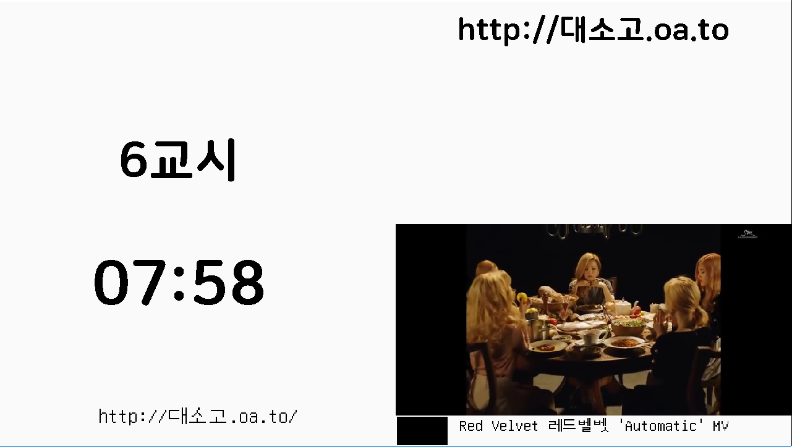

# Public Screen

기숙사동 1층에서 돌아가던 프로그램으 소스코드 입니다.
+ [Firbase](firebase.google.com)를 통해 공지와 유튜브 링크를 받아와서
표시해줍니다. 
+ 급식시간이 가까워지면 급식메뉴를 표시해줍니다.

왼쪽 화면에 현재 속한 시간과 현재 시간 오른쪽 위 화면에 공지, 오른쪽 아래에 유튜브가 재생 됩니다.

## 필요한 라이브러리
firebase 

pygame

python_jwt

gcloud

sseclient

pycryptodome

requests_toolbelt

moviepy

youtube-dl
